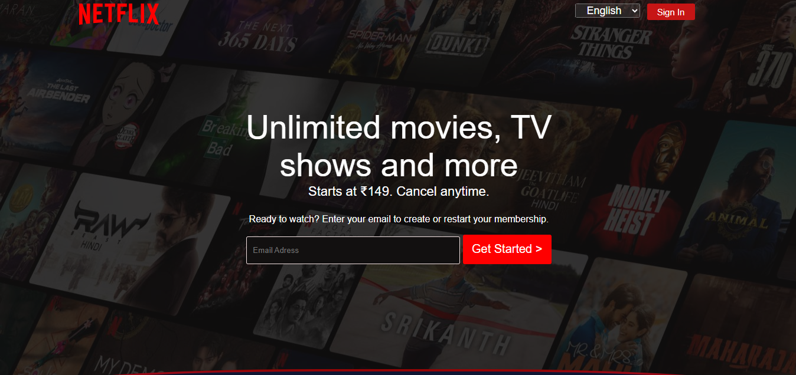
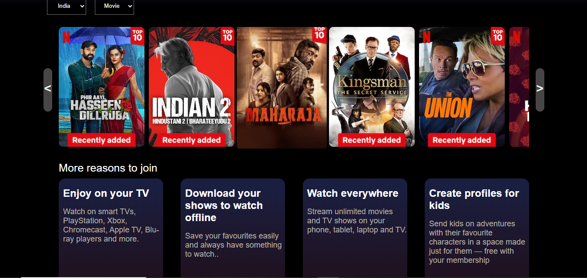
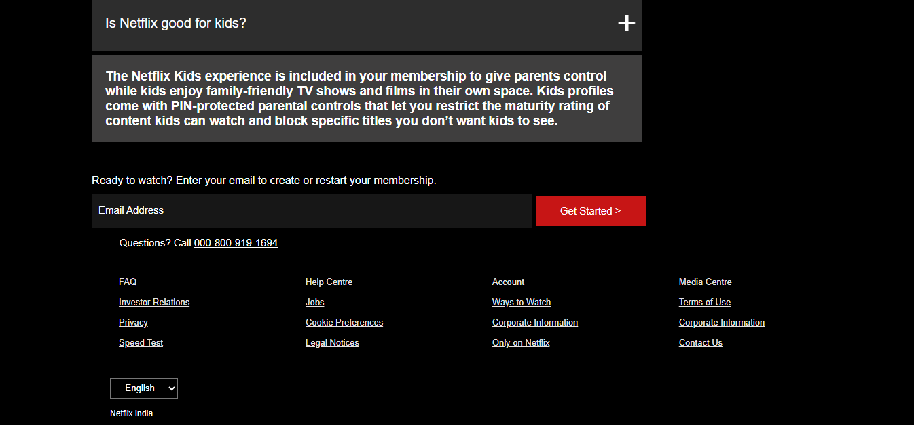

# Netflix Clone

A  **Netflix Clone** built using **HTML**, **CSS**, and **JavaScript**. This project replicates the core frontend interface of Netflix, including the homepage, navigation, and video thumbnails with hover effects.

## 🖼️ Screenshots

| Feature/Page     | Screenshot |
|------------------|------------|
| Home Page        |  |
| Card Section     |  |
| Footer Section   |  |

---

## 🌟 Features

- 🎬 Modern Netflix UI with grid-based layout  
- 🎥 Video banner section  
- 🔍 Search bar and user profile avatar  
- 🎞️ Horizontal scrollable categories  
- 🌙 Dark theme styling  
- 💡 Hover effects on thumbnails  

---

## 🚀 Technologies Used

- **HTML5** – Page structure  
- **CSS3** – Styling and responsiveness  
- **JavaScript** – Interactions and behavior  

---

